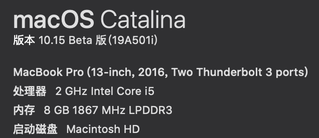

在上一篇文章中，我们讲了关于进制、补码和逻辑运算的数学基础。在这篇文章中，我们主要讨论的是硬件基础。由于汇编语言实际上是底层硬件的一个抽象，因此，我并不想太多地涉及底层硬件，只想大致讲一下硬盘-内存-CPU的这个三级结构。但这里要指出的是，实际上硬件层面远不止这么简单，还有一二三级缓存等复杂的结构。

# CPU、内存与硬盘

打开我们的Mac的系统信息，我们可以看到处理器和内存型号：

在磁盘工具中，我们也可以看到硬盘的型号：

处理器（即CPU）、内存和硬盘，这三者究竟有什么关系呢？

通过一个简单的计算我们可以知道，一块硬盘的大小为251GB, 那么一共有251,000,000,000个存储单元，也就是约10的11次方个存储单元；一块内存的大小为8GB, 那么一共有8,000,000,000个存储单元，也就是约10的9次方个存储单元；而一块Intel Core i5的CPU，由于采用x86-64架构，因此一共有16个通用寄存器。

因此，一块硬盘的存储容量是一块内存的100倍，是一个CPU的10,000,000,000倍！

那么，我们为什么要有这样的区分呢？能不能整个电脑的存储全用CPU的寄存器来做呢？答案是：理论上能，但实际上人类科技水平达不到，而且即使做出来也太贵了。我们从一个只有CPU，存储全靠寄存器的电脑入手，看如何能降低科技要求，削减开支。

CPU的功能是什么？是将寄存器中存储的值放到各种运算单元中进行处理。那么，我们在运行一个程序的时候，可能这个程序会有数以千计个变量，但是，在一段时间内参与运算的变量的个数却是非常少的，许多变量在参与运算后的很长一段时间内都不会再次参与运算。那么，我们不如只在CPU中保留少量的寄存器，用于存储当前参与运算的变量。然后将大部分不参与运算的变量存储在别的地方，在需要它们的时候再把它们导入到寄存器中。这就是内存(Memory)的功能。换句话说，CPU的功能主要是在寄存器中存储当前需要参与运算的变量，并可以用极高的速度将这些变量进行运算（从硬件层面上来讲，寄存器直连各种运算的器件）。当需要参与的变量不在寄存器中时，向内存发出访问申请，内存将变量导入CPU的寄存器中（这个时间与CPU寄存器参与运算的时间而言较慢）再参与运算。因此，内存的存储单元的速度可以比CPU的寄存器的慢一些，所以造价也就可以便宜一些。

那么运算全靠CPU，存储全靠内存，行不行呢？我们知道，在电脑中，不止有正在运行的程序，还有一些用于长期存储的文件。这些文件几乎很长时间才会运行一次。但是，CPU申请访问这些文件和申请访问那些经常运行的程序的优先级是相同的。这样的话，就会造成浪费。同时，CPU和内存也可以做到每次通电（也就是电脑启动）以后才会开始读写，一旦掉电（也就是电脑关机）那么所有数据就会消失。因此，我们将一些用于长期存储、电脑关机以后仍然需要保存的数据放到了硬盘(Disk)中，在程序运行的时候，将硬盘中的数据加载到内存中，再在CPU中参与运算。这样，硬盘的读写速度可以再进一步降低，成本也就进一步下降。

打个比方来说，硬盘、内存和CPU的关系就像是衣橱、工作台和针的关系。衣橱中存放的是已经编织好的衣服和一些毛线。当我们需要编织的时候，将毛线放在工作台上，然后用针穿起需要织的那一根线，进行编织。

# 存储单元

在内存和硬盘中，数据的存储的基本单位都是字节(Byte)。我们知道，在硬件中表示数据都是采用的二进制位，也就是`0`和`1`. 我们称每一位这样的二进制位为一个比特(Bit). 而一个字节，就是连续的八个比特。我们在汇编语言中，大部分情况下需要处理的最小的单位就是字节。一个字节，也可以看作是一个8位二进制数，或者一个2位16进制数。1字节常记做1B, 1比特常记做1b. 我们常用的单位还有KB(Kilobyte), KiB(Kibibyte)与GB(Gigabyte), GiB(Gibibyte). 严格来说，1KB=1000B, 1KiB=1024B, 1GB=1000KB, 1GiB=1024KiB. 在macOS以及iOS中采用的是这种标准的记法（可参考[iOS 和 macOS 如何报告储存容量](https://support.apple.com/zh-cn/HT201402#decimal)）。

内存和硬盘都是顺序编址。也就是说，我们要访问内存或者硬盘中的一个存储单元，那么就像我们想找人一样，首先要有它的名字。内存和硬盘给了每个存储单元（也就是一个字节）一个地址。相邻的存储单元的地址相邻。但是，内存和硬盘不同的一点在于，内存是随机访问(random access)的，也就是说，我想访问地址`0x0123456789abcdef`, 那么可以直接选择到这个地址，而不需要从`0`号地址开始向后找。最早期的硬盘则是要求顺序访问，也就是从某个特定的编号开始向后找。但后期的闪存技术可以弥补这一缺点。顺便提一句，内存这一随机访问的特点保证了线性表的O(1)的查找复杂度。

x86-64架构下的CPU中，通用寄存器都是64位，也就是8个字节。由于CPU是老大，因此，程序啊什么的都是跟着CPU来的。因此，在x86-64架构下，有的数据的大小是64位。这在CPU内部的运算中没什么问题，但遇到与内存交互时就犯了难。比如说，我有一个数据`0x0123456789abcdef`, 如果要从CPU中导到内存中，内存是按字节编址，也就是1个字节对应1个地址。那么，这个数据应该怎么存储在内存中呢？是`01 23 45 67 89 ab cd ef`还是`ef cd ab 89 67 45 23 01`呢？我编写了一个简单的程序来验证：我将`0x0123456789abcdef`这个数据导入了内存中地址为`0x00007ffeefbff7c8`的存储单元中。

这个结果告诉我们，我们现在通用的x86-64架构的处理器，将数据的高位放在高地址中。这种方法称为小端法(little-endian).

# CPU架构

我们常见的电脑上的CPU，有Intel Core i5, Intel Core i7, Intel Core i9等等，手机上的CPU，有苹果的A系列，还有高通的骁龙、华为的麒麟等等。这分属于两大阵营：电脑端处理器以x86架构为主，而手机端处理器以ARM架构为主。虽然处理器多种多样，性能有好有坏，但属于同一架构的CPU, 其各种基本属性都是差不多的。比如说通用寄存器数量、基础指令集等等。以前的CPU有16位、32位，意思是说通用寄存器的大小是16比特还是32比特。而现在常用的CPU都是64位的，属于x86-64架构。不同架构下的汇编语言也不同，所以我主要介绍的是x86-64的汇编语言。

# 可以在哪看到这系列文章

我在我的[GitHub](https://github.com/Evian-Zhang/Assembly-on-macOS)上，[知乎专栏](https://zhuanlan.zhihu.com/c_1132336120712765440)上和[CSDN](https://blog.csdn.net/EvianZhang)上同步更新。

上一篇文章：[macOS上的汇编入门（二）——数学基础](macOS上的汇编入门（二）——数学基础.md)

下一篇文章：[macOS上的汇编入门（四）——操作系统基础](macOS上的汇编入门（四）——操作系统基础.md)